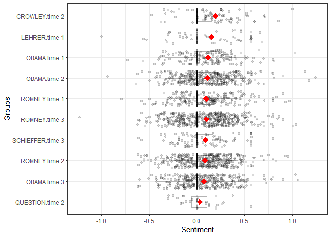
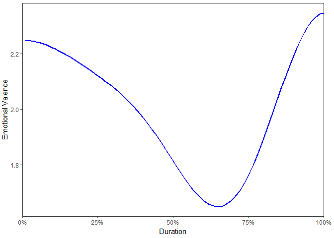
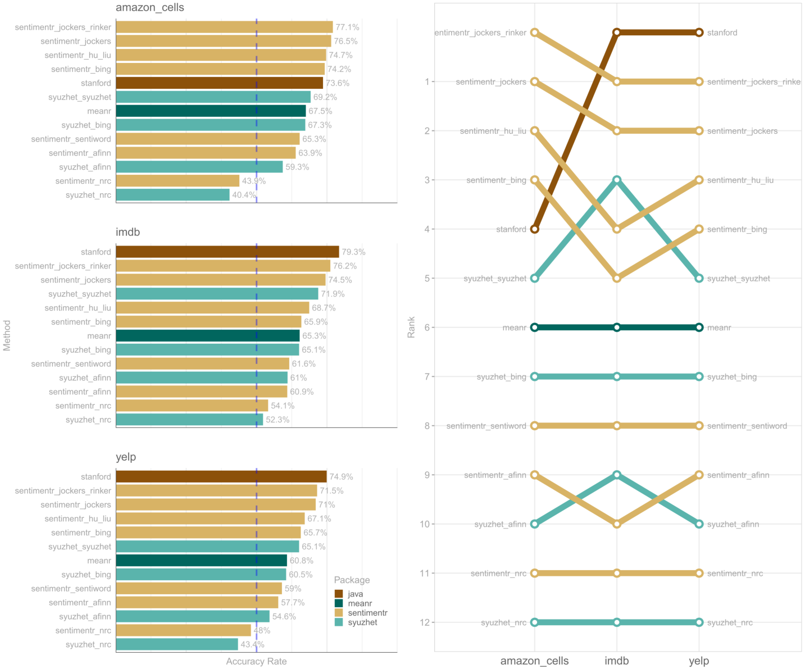
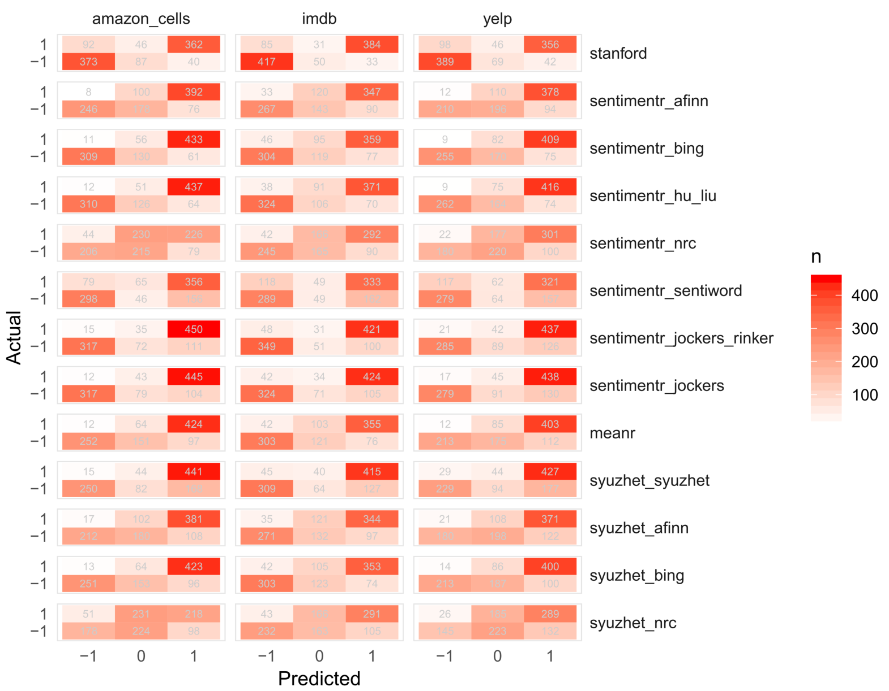
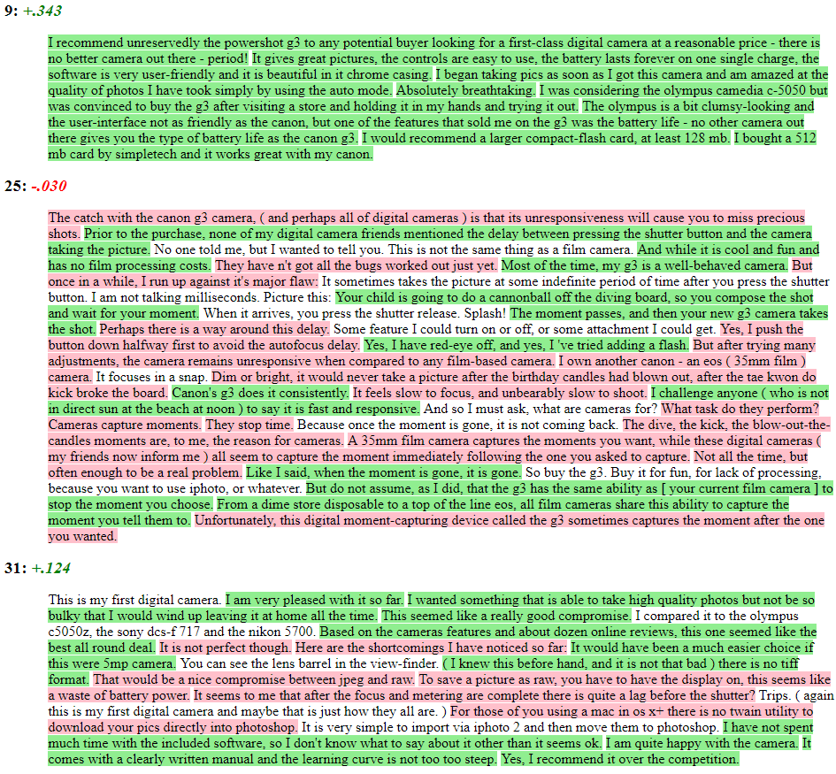

sentimentr   
============

**sentimentr** is designed to quickly calculate text polarity sentiment
at the sentence level and optionally aggregate by rows or grouping
variable(s).

**sentimentr** is a response to my own needs with sentiment detection
that were not addressed by the current **R** tools. My own `polarity`
function in the **qdap** package is slower on larger data sets. It is a
dictionary lookup approach that tries to incorporate weighting for
valence shifters (negation and amplifiers/deamplifiers). Matthew
Jocker's created the
[**syuzhet**](http://www.matthewjockers.net/2015/02/02/syuzhet/) package
that utilizes dictionary lookups for the Bing, NRC, and Afinn methods as
well as a custom dictionary. He also utilizes a wrapper for the
[Stanford coreNLP](http://nlp.stanford.edu/software/corenlp.shtml) which
uses much more sophisticated analysis. Jocker's dictionary methods are
fast but are more prone to error in the case of valence shifters.
Jocker's [addressed these
critiques](http://www.matthewjockers.net/2015/03/04/some-thoughts-on-annies-thoughts-about-syuzhet/)
explaining that the method is good with regard to analyzing general
sentiment in a piece of literature. He points to the accuracy of the
Stanford detection as well. In my own work I need better accuracy than a
simple dictionary lookup; something that considers valence shifters yet
optimizes speed which the Stanford's parser does not. This leads to a
trade off of speed vs. accuracy. Simply, **sentimentr** attempts to
balance accuracy and speed.

Table of Contents
============

-   [Why sentimentr](#why-sentimentr)
-   [Functions](#functions)
-   [The Equation](#the-equation)
-   [Installation](#installation)
-   [Examples](#examples)
    -   [Preferred Workflow](#preferred-workflow)
    -   [Tidy Approach](#tidy-approach)
    -   [Plotting](#plotting)
        -   [Plotting at Aggregated Sentiment](#plotting-at-aggregated-sentiment)
        -   [Plotting at the Sentence Level](#plotting-at-the-sentence-level)
    -   [Making and Updating Dictionaries](#making-and-updating-dictionaries)
    -   [Annie Swafford's Examples](#annie-swaffords-examples)
    -   [Comparing sentimentr, syuzhet, meanr, and Stanford](#comparing-sentimentr-syuzhet-meanr-and-stanford)
    -   [Text Highlighting](#text-highlighting)
-   [Contact](#contact)

Why sentimentr
============

***So what does*** **sentimentr** ***do that other packages don't and
why does it matter?***

> **sentimentr** attempts to take into account valence shifters (i.e.,
> negators, amplifiers (intensifiers), de-amplifiers (downtoners), and
> adversative conjunctions) while maintaining speed. Simply put,
> **sentimentr** is an augmented dictionary lookup. The next questions
> address why it matters.

***So what are these valence shifters?***

> A *negator* flips the sign of a polarized word (e.g., "I do ***not***
> like it."). See `lexicon::hash_valence_shifters[y==1]` for examples.
> An *amplifier* (intensifier) increases the impact of a polarized word
> (e.g., "I ***really*** like it."). See
> `lexicon::hash_valence_shifters[y==2]` for examples. A *de-amplifier*
> (downtoner) reduces the impact of a polarized word (e.g., "I
> ***hardly*** like it."). See `lexicon::hash_valence_shifters[y==3]`
> for examples. An *adversative conjunction* overrules the previous
> clause containing a polarized word (e.g., "I like it ***but*** it's
> not worth it."). See `lexicon::hash_valence_shifters[y==4]` for
> examples.

***Do valence shifters really matter?***

> Well valence shifters affect the polarized words. In the case of
> *negators* and *adversative conjunctions* the entire sentiment of the
> clause may be reversed or overruled. So if valence shifters occur
> fairly frequently a simple dictionary lookup may not be modeling the
> sentiment appropriately. You may be wondering how frequently these
> valence shifters co-occur with polarized words, potentially changing,
> or even reversing and overruling the clause's sentiment. The table
> below shows the rate of sentence level co-occurrence of valence
> shifters with polarized words across a few types of texts.

<table>
<thead>
<tr class="header">
<th align="left">Text</th>
<th align="right">Negator</th>
<th align="right">Amplifier</th>
<th align="right">Deamplifier</th>
<th align="right">Adversative</th>
</tr>
</thead>
<tbody>
<tr class="odd">
<td align="left">Cannon reviews</td>
<td align="right">21%</td>
<td align="right">23%</td>
<td align="right">8%</td>
<td align="right">12%</td>
</tr>
<tr class="even">
<td align="left">2012 presidential debate</td>
<td align="right">23%</td>
<td align="right">18%</td>
<td align="right">1%</td>
<td align="right">11%</td>
</tr>
<tr class="odd">
<td align="left">Trump speeches</td>
<td align="right">12%</td>
<td align="right">14%</td>
<td align="right">3%</td>
<td align="right">10%</td>
</tr>
<tr class="even">
<td align="left">Trump tweets</td>
<td align="right">19%</td>
<td align="right">18%</td>
<td align="right">4%</td>
<td align="right">4%</td>
</tr>
<tr class="odd">
<td align="left">Dylan songs</td>
<td align="right">4%</td>
<td align="right">10%</td>
<td align="right">0%</td>
<td align="right">4%</td>
</tr>
<tr class="even">
<td align="left">Austen books</td>
<td align="right">21%</td>
<td align="right">18%</td>
<td align="right">6%</td>
<td align="right">11%</td>
</tr>
<tr class="odd">
<td align="left">Hamlet</td>
<td align="right">26%</td>
<td align="right">17%</td>
<td align="right">2%</td>
<td align="right">16%</td>
</tr>
</tbody>
</table>

Indeed *negators* appear ~20% of the time a polarized word appears in a
sentence. Conversely, *adversative conjunctions* appear with polarized
words ~10% of the time. Not accounting for the valence shifters could
significantly impact the modeling of the text sentiment.

The [script to replicate the frequency
analysis](https://raw.githubusercontent.com/trinker/sentimentr/master/inst/the_case_for_sentimentr/valence_shifter_cooccurrence_rate.R),
shown in the table above, can be accessed via:

    val_shift_freq <- system.file("the_case_for_sentimentr/valence_shifter_cooccurrence_rate.R", package = "sentimentr")
    file.copy(val_shift_freq, getwd())

Functions
=========

There are two main functions (top 2 in table below) in **sentimentr**
with several helper functions summarized in the table below:

<table style="width:100%;">
<colgroup>
<col width="25%" />
<col width="74%" />
</colgroup>
<thead>
<tr class="header">
<th>Function</th>
<th>Description</th>
</tr>
</thead>
<tbody>
<tr class="odd">
<td><code>sentiment</code></td>
<td>Sentiment at the sentence level</td>
</tr>
<tr class="even">
<td><code>sentiment_by</code></td>
<td>Aggregated sentiment by group(s)</td>
</tr>
<tr class="odd">
<td><code>uncombine</code></td>
<td>Extract sentence level sentiment from <code>sentiment_by</code></td>
</tr>
<tr class="even">
<td><code>get_sentences</code></td>
<td>Regex based string to sentence parser (or get sentences from <code>sentiment</code>/<code>sentiment_by</code>)</td>
</tr>
<tr class="odd">
<td><code>replace_emoticon</code></td>
<td>Replace emoticons with word equivalent</td>
</tr>
<tr class="even">
<td><code>replace_grade</code></td>
<td>Replace grades (e.g., &quot;A+&quot;) with word equivalent</td>
</tr>
<tr class="odd">
<td><code>replace_rating</code></td>
<td>Replace ratings (e.g., &quot;10 out of 10&quot;, &quot;3 stars&quot;) with word equivalent</td>
</tr>
<tr class="even">
<td><code>as_key</code></td>
<td>Coerce a <code>data.frame</code> lexicon to a polarity hash key</td>
</tr>
<tr class="odd">
<td><code>is_key</code></td>
<td>Check if an object is a hash key</td>
</tr>
<tr class="even">
<td><code>update_key</code></td>
<td>Add/remove terms to/from a hash key</td>
</tr>
<tr class="odd">
<td><code>highlight</code></td>
<td>Highlight positive/negative sentences as an HTML document</td>
</tr>
<tr class="even">
<td><code>general_rescale</code></td>
<td>Generalized rescaling function to rescale sentiment scoring</td>
</tr>
<tr class="odd">
<td><code>sentiment_attribute</code></td>
<td>Extract the sentiment based attributes from a text</td>
</tr>
<tr class="even">
<td><code>validate_sentiment</code></td>
<td>Validate sentiment score sign against known results</td>
</tr>
</tbody>
</table>

The Equation
============

The equation below describes the augmented dictionary method of
**sentimentr** that may give better results than a simple lookup
dictionary approach that does not consider valence shifters. The
equation used by the algorithm to assign value to polarity of each
sentence fist utilizes the a sentiment dictionary (e.g., Jockers,
[(2017)](https://github.com/mjockers/syuzhet)) to tag polarized words.
Each paragraph
(*p**i* = {*s*1, *s*2, ..., *s**n*})
composed of sentences, is broken into element sentences
(*s**i*, *j* = {*w*1, *w*2, ..., *w**n*})
where *w* are the words within sentences. Each sentence
(*s**j*) is broken into a an ordered bag of words.
Punctuation is removed with the exception of pause punctuations (commas,
colons, semicolons) which are considered a word within the sentence. I
will denote pause words as *c**w* (comma words) for convenience. We can
represent these words as an i,j,k notation as
*w**i*, *j*, *k*. For example *w*3, 2, 5 would be
the fifth word of the second sentence of the third paragraph. While I
use the term paragraph this merely represent a complete turn of talk.
For example it may be a cell level response in a questionnaire composed
of sentences.

The words in each sentence (*w**i*, *j*, *k*) are searched
and compared to a dictionary of polarized words (e.g., a slightly
modified version of Jocker's (2017) dictionary in the
[**lexicon**](https://cran.r-project.org/package=lexicon) package
originally exported by the
[**syuzhet**](https://github.com/mjockers/syuzhet) package). Positive
(*w**i*, *j*, *k*+) and negative
(*w**i*, *j*, *k*−) words are tagged with a +1 and
−1 respectively (or other positive/negative weighting if the user
provides the sentiment dictionary). I will denote polarized words as
*p**w* for convenience. These will form a polar cluster
(*c**i*, *j*, *l*) which is a subset of the a sentence
(*c**i*, *j*, *l* ⊆ *s**i*, *j*).

The polarized context cluster (*c**i*, *j*, *l*) of words is
pulled from around the polarized word (*p**w*) and defaults to 4 words
before and two words after *p**w* to be considered as valence shifters.
The cluster can be represented as
(*c**i*, *j*, *l* = {*p**w**i*, *j*, *k* − *n**b*, ..., *p**w**i*, *j*, *k*, ..., *p**w**i*, *j*, *k* − *n**a*}),
where *n**b* & *n**a* are the parameters `n.before` and `n.after` set by
the user. The words in this polarized context cluster are tagged as
neutral (*w**i*, *j*, *k*0), negator
(*w**i*, *j*, *k**n*), amplifier \[intensifier\]
(*w**i*, *j*, *k**a*), or de-amplifier
\[downtoner\] (*w**i*, *j*, *k**d*). Neutral words
hold no value in the equation but do affect word count (*n*). Each
polarized word is then weighted (*w*) based on the weights from the
`polarity_dt` argument and then further weighted by the function and
number of the valence shifters directly surrounding the positive or
negative word (*p**w*). Pause (*c**w*) locations (punctuation that
denotes a pause including commas, colons, and semicolons) are indexed
and considered in calculating the upper and lower bounds in the
polarized context cluster. This is because these marks indicate a change
in thought and words prior are not necessarily connected with words
after these punctuation marks. The lower bound of the polarized context
cluster is constrained to
max{*p**w**i*, *j*, *k* − *n**b*, 1, max{*c**w**i*, *j*, *k* &lt; *p**w**i*, *j*, *k*}}
and the upper bound is constrained to
min{*p**w**i*, *j*, *k* + *n**a*, *w**i*, *j**n*, min{*c**w**i*, *j*, *k* &gt; *p**w**i*, *j*, *k*}}
where *w**i*, *j**n* is the number of words in the sentence.

The core value in the cluster, the polarized word is acted upon by
valence shifters. Amplifiers increase the polarity by 1.8 (.8 is the
default weight (*z*)). Amplifiers
(*w**i*, *j*, *k**a*) become de-amplifiers if the
context cluster contains an odd number of negators
(*w**i*, *j*, *k**n*). De-amplifiers work to
decrease the polarity. Negation
(*w**i*, *j*, *k**n*) acts on
amplifiers/de-amplifiers as discussed but also flip the sign of the
polarized word. Negation is determined by raising −1 to the power of the
number of negators (*w**i*, *j*, *k**n*) plus 2.
Simply, this is a result of a belief that two negatives equal a
positive, 3 negatives a negative, and so on.

The adversative conjunctions (i.e., 'but', 'however', and 'although')
also weight the context cluster. An adversative conjunction before the
polarized word
(*w**a**d**v**e**r**s**a**t**i**v**e* *c**o**n**j**u**n**c**t**i**o**n*, ..., *w**i*, *j*, *k**p*)
up-weights the cluster by 1 +
*z*2 \* {|*w**a**d**v**e**r**s**a**t**i**v**e* *c**o**n**j**u**n**c**t**i**o**n*|,...,*w**i*, *j*, *k**p*}
(.85 is the default weight (*z*2) where
|*w**a**d**v**e**r**s**a**t**i**v**e* *c**o**n**j**u**n**c**t**i**o**n*|
are the number of adversative conjunctions before the polarized word). A
adversative conjunction after the polarized word down-weights the
cluster by 1 +
{*w**i*, *j*, *k**p*, ..., |*w**a**d**v**e**r**s**a**t**i**v**e* *c**o**n**j**u**n**c**t**i**o**n*|\* − 1}\**z*2.
This corresponds to the belief that an adversative conjunction makes the
next clause of greater values while lowering the value placed on the
prior clause.

The researcher may provide a weight (*z*) to be utilized with
amplifiers/de-amplifiers (default is .8; de-amplifier weight is
constrained to −1 lower bound). Last, these weighted context clusters
(*c**i*, *j*, *l*) are summed (*c*′*i*, *j*) and
divided by the square root of the word count
(√*w**i*, *j**n*) yielding an unbounded polarity score
(*δ**i*, *j*) for each sentence.

*δ**i**j* =
<em>c</em>'*i**j*/√*w**i**j**n*

Where:

*c*′*i*, *j* = ∑((1 + *w**a**m**p* + *w**d**e**a**m**p*)⋅*w**i*, *j*, *k**p*(−1)2 + *w**n**e**g*)

*w**a**m**p* = ∑(*w**n**e**g* ⋅ (*z* ⋅ *w**i*, *j*, *k**a*))

*w**d**e**a**m**p* = max(*w**d**e**a**m**p*′, −1)

*w**d**e**a**m**p*′ = ∑(*z*(−*w**n**e**g* ⋅ *w**i*, *j*, *k**a* + *w**i*, *j*, *k**d*))

*w**b* = 1 + *z*2 \* *w**b*′

*w**b*′ = ∑(|*w**a**d**v**e**r**s**a**t**i**v**e* *c**o**n**j**u**n**c**t**i**o**n*|,...,*w**i*, *j*, *k**p*, *w**i*, *j*, *k**p*, ..., |*w**a**d**v**e**r**s**a**t**i**v**e* *c**o**n**j**u**n**c**t**i**o**n*|\* − 1)

*w**n**e**g* = (∑*w**i*, *j*, *k**n* )
mod 2

To get the mean of all sentences (*s**i*, *j*) within a
paragraph/turn of talk (*p**i*) simply take the average
sentiment score *p**i*, *δ**i*, *j* = 1/n ⋅ ∑
*δ**i*, *j* or use an available weighted average (the default
`average_weighted_mixed_sentiment` which upweights the negative values
in a vector while also downweighting the zeros in a vector or
`average_downweighted_zero` which simply downweights the zero polarity
scores).

Installation
============

To download the development version of **sentimentr**:

Download the [zip
ball](https://github.com/trinker/sentimentr/zipball/master) or [tar
ball](https://github.com/trinker/sentimentr/tarball/master), decompress
and run `R CMD INSTALL` on it, or use the **pacman** package to install
the development version:

    if (!require("pacman")) install.packages("pacman")
    pacman::p_load_current_gh("trinker/lexicon", "trinker/sentimentr")

Examples
========

    if (!require("pacman")) install.packages("pacman")
    pacman::p_load(sentimentr, dplyr, magrittr)

Preferred Workflow
------------------

Here is a basic `sentiment` demo. Notice that the first thing you should
do is to split your text data into sentences (a process called sentence
boundary disambiguation) via the `get_sentences` function. This can be
handled within `sentiment` (i.e., you can pass a raw character vector)
but it slows the function down and should be done one time rather than
every time the function is called. Additionally, a warning will be
thrown if a larger raw character vector is passed. The preferred
workflow is to spit the text into sentences with `get_sentences` before
any sentiment analysis is done.

    mytext <- c(
        'do you like it?  But I hate really bad dogs',
        'I am the best friend.',
        'Do you really like it?  I\'m not a fan'
    )

    mytext <- get_sentences(mytext)
    sentiment(mytext)

    ##    element_id sentence_id word_count  sentiment
    ## 1:          1           1          4  0.2500000
    ## 2:          1           2          6 -2.0085816
    ## 3:          2           1          5  0.5813777
    ## 4:          3           1          5  0.4024922
    ## 5:          3           2          4  0.0000000

To aggregate by element (column cell or vector element) use
`sentiment_by` with `by = NULL`.

    mytext <- c(
        'do you like it?  But I hate really bad dogs',
        'I am the best friend.',
        'Do you really like it?  I\'m not a fan'
    )
    mytext <- get_sentences(mytext)
    sentiment_by(mytext)

    ##    element_id word_count       sd ave_sentiment
    ## 1:          1         10 1.597058    -0.8792908
    ## 2:          2          5       NA     0.5813777
    ## 3:          3          9 0.284605     0.2196345

To aggregate by grouping variables use `sentiment_by` using the `by`
argument.

    (out <- with(
        presidential_debates_2012, 
        sentiment_by(
            get_sentences(dialogue), 
            list(person, time)
        )
    ))

    ##        person   time word_count        sd ave_sentiment
    ##  1:     OBAMA time 1       3598 0.3015097    0.16673169
    ##  2:     OBAMA time 2       7476 0.2399589    0.11663216
    ##  3:     OBAMA time 3       7241 0.2614870    0.11842952
    ##  4:    ROMNEY time 1       4085 0.2505313    0.12462353
    ##  5:    ROMNEY time 2       7534 0.2382667    0.08540709
    ##  6:    ROMNEY time 3       8302 0.2846332    0.10652350
    ##  7:   CROWLEY time 2       1672 0.1878174    0.17977897
    ##  8:    LEHRER time 1        765 0.2847680    0.18338771
    ##  9:  QUESTION time 2        583 0.2076347    0.06625726
    ## 10: SCHIEFFER time 3       1445 0.2471048    0.08780297

Tidy Approach
-------------

Or if you prefer a more tidy approach:

    library(magrittr)
    library(dplyr)

    presidential_debates_2012 %>%
        dplyr::mutate(dialogue_split = get_sentences(dialogue)) %$%
        sentiment_by(dialogue_split, list(person, time))

    ##        person   time word_count        sd ave_sentiment
    ##  1:     OBAMA time 1       3598 0.3015097    0.16673169
    ##  2:     OBAMA time 2       7476 0.2399589    0.11663216
    ##  3:     OBAMA time 3       7241 0.2614870    0.11842952
    ##  4:    ROMNEY time 1       4085 0.2505313    0.12462353
    ##  5:    ROMNEY time 2       7534 0.2382667    0.08540709
    ##  6:    ROMNEY time 3       8302 0.2846332    0.10652350
    ##  7:   CROWLEY time 2       1672 0.1878174    0.17977897
    ##  8:    LEHRER time 1        765 0.2847680    0.18338771
    ##  9:  QUESTION time 2        583 0.2076347    0.06625726
    ## 10: SCHIEFFER time 3       1445 0.2471048    0.08780297

Note that you can skip the `dplyr::mutate` step by using `get_sentences`
on a `data.frame` as seen below:

    presidential_debates_2012 %>%
        get_sentences() %$%
        sentiment_by(dialogue, list(person, time))

    ##        person   time word_count        sd ave_sentiment
    ##  1:     OBAMA time 1       3598 0.3015097    0.16673169
    ##  2:     OBAMA time 2       7476 0.2399589    0.11663216
    ##  3:     OBAMA time 3       7241 0.2614870    0.11842952
    ##  4:    ROMNEY time 1       4085 0.2505313    0.12462353
    ##  5:    ROMNEY time 2       7534 0.2382667    0.08540709
    ##  6:    ROMNEY time 3       8302 0.2846332    0.10652350
    ##  7:   CROWLEY time 2       1672 0.1878174    0.17977897
    ##  8:    LEHRER time 1        765 0.2847680    0.18338771
    ##  9:  QUESTION time 2        583 0.2076347    0.06625726
    ## 10: SCHIEFFER time 3       1445 0.2471048    0.08780297

Plotting
--------

### Plotting at Aggregated Sentiment

    plot(out)

### Plotting at the Sentence Level

The `plot` method for the class `sentiment` uses **syuzhet**'s
`get_transformed_values` combined with **ggplot2** to make a reasonable,
smoothed plot for the duration of the text based on percentage, allowing
for comparison between plots of different texts. This plot gives the
overall shape of the text's sentiment. The user can see
`syuzhet::get_transformed_values` for more details.

    plot(uncombine(out))

Making and Updating Dictionaries
--------------------------------

It is pretty straight forward to make or update a new dictionary
(polarity or valence shifter). To create a key from scratch the user
needs to create a 2 column `data.frame`, with words on the left and
values on the right (see `?lexicon::hash_sentiment_huliu` &
`?lexicon::hash_valence_shifters` for what the values mean). Note that
the words need to be lower cased. Here I show an example `data.frame`
ready for key conversion:

    set.seed(10)
    key <- data.frame(
        words = sample(letters),
        polarity = rnorm(26),
        stringsAsFactors = FALSE
    )

This is not yet a key. **sentimentr** provides the `is_key` function to
test if a table is a key.

    is_key(key)

    ## [1] FALSE

It still needs to be **data.table**-ified. The `as_key` function coerces
a `data.frame` to a **data.table** with the left column named `x` and
the right column named `y`. It also checks the key against another key
to make sure there is not overlap using the `compare` argument. By
default `as_key` checks against `valence_shifters_table`, assuming the
user is creating a sentiment dictionary. If the user is creating a
valence shifter key then a sentiment key needs to be passed to `compare`
instead and set the argument `sentiment = FALSE`. Below I coerce `key`
to a dictionary that **sentimentr** can use.

    mykey <- as_key(key)

Now we can check that `mykey` is a usable dictionary:

    is_key(mykey)

    ## [1] TRUE

The key is ready for use:

    sentiment_by("I am a human.", polarity_dt = mykey)

    ##    element_id word_count sd ave_sentiment
    ## 1:          1          4 NA    -0.7594893

You can see the values of a key that correspond to a word using
**data.table** syntax:

    mykey[c("a", "b")][[2]]

    ## [1] -0.2537805 -0.1951504

Updating (adding or removing terms) a key is also useful. The
`update_key` function allows the user to add or drop terms via the `x`
(add a `data.frame`) and `drop` (drop a term) arguments. Below I drop
the "a" and "h" terms (notice there are now 24 rows rather than 26):

    mykey_dropped <- update_key(mykey, drop = c("a", "h"))
    nrow(mykey_dropped)

    ## [1] 24

    sentiment_by("I am a human.", polarity_dt = mykey_dropped)

    ##    element_id word_count sd ave_sentiment
    ## 1:          1          4 NA     -0.632599

Next I add the terms "dog" and "cat" as a `data.frame` with sentiment
values:

    mykey_added <- update_key(mykey, x = data.frame(x = c("dog", "cat"), y = c(1, -1)))

    ## Warning in as_key(x, comparison = comparison, sentiment = sentiment): Column 1 was a factor...
    ## Converting to character.

    nrow(mykey_added)

    ## [1] 28

    sentiment("I am a human. The dog.  The cat", polarity_dt = mykey_added)

    ##    element_id sentence_id word_count  sentiment
    ## 1:          1           1          4 -0.7594893
    ## 2:          1           2          2  0.7071068
    ## 3:          1           3          2 -0.7071068

Annie Swafford's Examples
-------------------------

[Annie
Swafford](https://annieswafford.wordpress.com/2015/03/02/syuzhet/)
critiqued Jocker's approach to sentiment and gave the following examples
of sentences (`ase` for Annie Swafford example). Here I test each of
Jocker's 4 dictionary approaches (syuzhet, Bing, NRC, Afinn), his
Stanford wrapper (note I use my own [GitHub Stanford wrapper
package](https://github.com/trinker/stansent) based off of Jocker's
approach as it works more reliably on my own Windows machine), the
[RSentiment](https://cran.r-project.org/package=RSentiment) package, the
lookup based
[SentimentAnalysis](https://github.com/sfeuerriegel/SentimentAnalysis)
package, the [meanr](https://github.com/wrathematics/meanr) package
(written in C level code), and my own algorithm with default Jockers
(2017) polarity lexicon as well as Hu & Liu (2004) and [Baccianella,
Esuli and Sebastiani's (2010)](http://sentiwordnet.isti.cnr.it/)
SentiWord lexicons available from the
[**lexicon**](https://github.com/trinker/lexicon) package.

    if (!require("pacman")) install.packages("pacman")
    pacman::p_load_gh("trinker/sentimentr", "trinker/stansent", "sfeuerriegel/SentimentAnalysis", "wrathematics/meanr")
    pacman::p_load(syuzhet, qdap, microbenchmark, RSentiment)

    ase <- c(
        "I haven't been sad in a long time.",
        "I am extremely happy today.",
        "It's a good day.",
        "But suddenly I'm only a little bit happy.",
        "Then I'm not happy at all.",
        "In fact, I am now the least happy person on the planet.",
        "There is no happiness left in me.",
        "Wait, it's returned!",
        "I don't feel so bad after all!"
    )

    syuzhet <- setNames(as.data.frame(lapply(c("syuzhet", "bing", "afinn", "nrc"),
        function(x) get_sentiment(ase, method=x))), c("syuzhet", "bing", "afinn", "nrc"))

    SentimentAnalysis <- apply(analyzeSentiment(ase)[c('SentimentGI', 'SentimentLM', 'SentimentQDAP') ], 2, round, 2)
    colnames(SentimentAnalysis) <- gsub('^Sentiment', "SA_", colnames(SentimentAnalysis))

    left_just(data.frame(
        stanford = sentiment_stanford(ase)[["sentiment"]],
        sentimentr_jockers = round(sentiment(ase, question.weight = 0)[["sentiment"]], 2),
        sentimentr_huliu = round(sentiment(ase, lexicon::hash_sentiment_huliu, question.weight = 0)[["sentiment"]], 2),    
        sentimentr_sentiword = round(sentiment(ase, lexicon::hash_sentiment_sentiword, question.weight = 0)[["sentiment"]], 2),    
        RSentiment = calculate_score(ase), 
        SentimentAnalysis,
        meanr = score(ase)[['score']],
        syuzhet,
        sentences = ase,
        stringsAsFactors = FALSE
    ), "sentences")

    [1] "Processing sentence: i have not been sad in a long time"
    [1] "Processing sentence: i am extremely happy today"
    [1] "Processing sentence: its a good day"
    [1] "Processing sentence: but suddenly im only a little bit happy"
    [1] "Processing sentence: then im not happy at all"
    [1] "Processing sentence: in fact i am now the least happy person on the planet"
    [1] "Processing sentence: there is no happiness left in me"
    [1] "Processing sentence: wait its returned"
    [1] "Processing sentence: i do not feel so bad after all"

      stanford sentimentr_jockers sentimentr_huliu sentimentr_sentiword
    1     -0.5               0.18             0.35                 0.18
    2        1                0.6              0.8                 0.65
    3      0.5               0.38              0.5                 0.32
    4     -0.5                  0                0                    0
    5     -0.5              -0.31            -0.41                -0.56
    6     -0.5               0.04             0.06                 0.11
    7     -0.5              -0.28            -0.38                -0.05
    8        0              -0.14                0                -0.14
    9     -0.5               0.28             0.38                 0.24
      RSentiment SA_GI SA_LM SA_QDAP meanr syuzhet bing afinn nrc
    1          1 -0.25     0   -0.25    -1    -0.5   -1    -2   0
    2          1  0.33  0.33       0     1    0.75    1     3   1
    3          1   0.5   0.5     0.5     1    0.75    1     3   1
    4          0     0  0.25    0.25     1    0.75    1     3   1
    5         -1     1     1       1     1    0.75    1     3   1
    6          1  0.17  0.17    0.33     1    0.75    1     3   1
    7          1   0.5   0.5     0.5     1    0.75    1     2   1
    8         -1     0     0       0     0   -0.25    0     0  -1
    9          0 -0.33 -0.33   -0.33    -1   -0.75   -1    -3  -1
      sentences                                              
    1 I haven't been sad in a long time.                     
    2 I am extremely happy today.                            
    3 It's a good day.                                       
    4 But suddenly I'm only a little bit happy.              
    5 Then I'm not happy at all.                             
    6 In fact, I am now the least happy person on the planet.
    7 There is no happiness left in me.                      
    8 Wait, it's returned!                                   
    9 I don't feel so bad after all!                         

Also of interest is the computational time used by each of these
methods. To demonstrate this I increased Annie's examples by 100
replications and **microbenchmark** on a few iterations (Stanford takes
so long I didn't extend to more). Note that if a text needs to be broken
into sentence parts **syuzhet** has the `get_sentences` function that
uses the **openNLP** package, this is a time expensive task.
**sentimentr** uses a much faster regex based approach that is nearly as
accurate in parsing sentences with a much lower computational time. We
see that **RSentiment** and Stanford take the longest time while
**sentimentr** and **syuzhet** are comparable depending upon lexicon
used. **meanr** is lighting fast. **SentimentAnalysis** is a bit slower
than other methods but is returning 3 scores from 3 different
dictionaries.

    ase_100 <- rep(ase, 100)
     
    stanford <- function() {sentiment_stanford(ase_100)}

    sentimentr_jockers <- function() sentiment(ase, lexicon::hash_sentiment_jockers)
    sentimentr_huliu <- function() sentiment(ase, lexicon::hash_sentiment_huliu)
    sentimentr_sentiword <- function() sentiment(ase, lexicon::hash_sentiment_sentiword) 
        
    RSentiment <- function() calculate_score(ase_100) 
        
    SentimentAnalysis <- function() analyzeSentiment(ase_100)

    meanr <- function() score(ase_100)

    syuzhet_syuzhet <- function() get_sentiment(ase_100, method="syuzhet")
    syuzhet_binn <- function() get_sentiment(ase_100, method="bing")
    syuzhet_nrc <- function() get_sentiment(ase_100, method="nrc")
    syuzhet_afinn <- function() get_sentiment(ase_100, method="afinn")
         
    microbenchmark(
        stanford(),
        sentimentr_jockers(),
        sentimentr_huliu(),
        sentimentr_sentiword(),
        RSentiment(), 
        SentimentAnalysis(),
        syuzhet_syuzhet(),
        syuzhet_binn(), 
        syuzhet_nrc(),
        syuzhet_afinn(),
        meanr(),
        times = 3
    )

    Unit: microseconds
                       expr           min            lq          mean
                 stanford()  29295281.790  29400023.402  29734984.964
       sentimentr_jockers()    228599.112    234849.279    241180.734
         sentimentr_huliu()    266767.251    271540.065    280659.613
     sentimentr_sentiword()   1015145.899   1028339.030   1050132.847
               RSentiment() 194034175.571 201517746.098 283900476.987
        SentimentAnalysis()   8380587.287   8703374.491   8815665.514
          syuzhet_syuzhet()    464279.337    483483.492    492185.992
             syuzhet_binn()    400259.877    410813.191    417908.880
              syuzhet_nrc()    765286.614    926356.089    987816.747
            syuzhet_afinn()    177743.019    185607.456    190791.706
                    meanr()       978.744      1199.208      1358.363
            median            uq           max neval
      29504765.013  29954836.552  30404908.090     3
        241099.445    247471.545    253843.644     3
        276312.879    287605.794    298898.709     3
       1041532.162   1067626.321   1093720.480     3
     209001316.624 328833627.696 448665938.767     3
       9026161.695   9033204.628   9040247.560     3
        502687.646    506139.319    509590.993     3
        421366.506    426733.381    432100.256     3
       1087425.564   1099081.813   1110738.062     3
        193471.893    197316.050    201160.206     3
          1419.672      1548.173      1676.674     3

Comparing sentimentr, syuzhet, meanr, and Stanford
--------------------------------------------------

The accuracy of an algorithm weighs heavily into the decision as to what
approach to take in sentiment detection. I have selected
algorithms/packages that stand out as fast and/or accurate to perform
benchmarking on actual data. Both **syuzhet** and **sentimentr** provide
multiple dictionaries with a general algorithm to compute sentiment
scores. **syuzhet** provides 4 approaches while **sentimentr** provides
2, but can be extended easily using the 4 dictionaries from the
**syuzhet** package. **meanr** is a very fast algorithm. The follow
visualization provides the accuracy of these approaches in comparison to
Stanford's **Java** based implementation of sentiment detection. The
visualization is generated from testing on three reviews data sets from
Kotzias, Denil, De Freitas, & Smyth (2015). These authors utilized the
three 1000 element data sets from:

-   amazon.com
-   imdb.com
-   yelp.com

The data sets are hand scored as either positive or negative. The
testing here uses [Mean Directional Accuracy
(MDA)](https://en.wikipedia.org/wiki/Mean_Directional_Accuracy_(MDA))
and merely matches the sign of the algorithm to the human coded output
to determine accuracy rates.

-   Kotzias, D., Denil, M., De Freitas, N., & Smyth,P. (2015). *From
    group to individual labels using deep features*. Proceedings of the
    21th ACM SIGKDD International Conference on Knowledge Discovery and
    Data Mining. 597-606.
    <http://mdenil.com/media/papers/2015-deep-multi-instance-learning.pdf>

The bar graph on the left shows the accuracy rates for the various
sentiment set-ups in the three review contexts. The rank plot on the
right shows how the rankings for the methods varied across the three
review contexts.

The take away here seems that, unsurprisingly, Stanford's algorithm
consistently outscores **sentimentr**, **syuzhet**, and **meanr**. The
**sentimentr** approach loaded with the Jockers' custom **syuzhet**
dictionary is a top pick for speed and accuracy. In addition to Jockers'
custom dictionary the `bing` dictionary also performs well within both
the **syuzhet** and **sentimentr** algorithms. Generally, the
**sentimentr** algorithm out performs **syuzhet** when their
dictionaries are comparable.

It is important to point out that this is a small sample data set that
covers a narrow range of uses for sentiment detection. Jockers'
**syuzhet** was designed to be applied across book chunks and it is, to
some extent, unfair to test it out of this context. Still this initial
analysis provides a guide that may be of use for selecting the sentiment
detection set up most applicable to the reader's needs.

The reader may access the R script used to generate this visual via:

    testing <- system.file("sentiment_testing/sentiment_testing.R", package = "sentimentr")
    file.copy(testing, getwd())

In the figure below we compare raw table counts as a heat map, plotting
the predicted values from the various algorithms on the x axis versus
the human scored values on the y axis.

Across all three contexts, notice that the Stanford coreNLP algorithm is
better at:

-   Detecting negative sentiment as negative
-   Discrimination (i.e., reducing neutral assignments)

The Jockers, Bing, Hu & Lu, and Afinn dictionaries all do well with
regard to not assigning negative scores to positive statements, but
perform less well in the reverse, often assigning positive scores to
negative statements, though Jockers' dictionary outperforms the others.
We can now see that the reason for the NRC's poorer performance in
accuracy rate above is its inability to discriminate. The Sentiword
dictionary does well at discriminating (like Stanford's coreNLP) but
lacks accuracy. We can deduce two things from this observation:

1.  Larger dictionaries discriminate better (Sentiword \[n =
    20,100\] vs. Hu & Lu \[n = 6,875\])
2.  The Sentiword dictionary may have words with reversed polarities

A reworking of the Sentiword dictionary may yield better results for a
dictionary lookup approach to sentiment detection, potentially,
improving on discrimination and accuracy.

The reader may access the R script used to generate this visual via:

    testing2 <- system.file("sentiment_testing/raw_results.R", package = "sentimentr")
    file.copy(testing2, getwd())

Text Highlighting
-----------------

The user may wish to see the output from `sentiment_by` line by line
with positive/negative sentences highlighted. The `highlight` function
wraps a `sentiment_by` output to produces a highlighted HTML file
(positive = green; negative = pink). Here we look at three random
reviews from Hu and Liu's (2004) Cannon G3 Camera Amazon product
reviews.

    library(magritrr)
    library(dplyr)
    set.seed(2)

    cannon_reviews %>%
        filter(number %in% sample(unique(number), 3)) %>%
        mutate(review = get_sentences(review)) %$%
        sentiment_by(review, number) %>%
        highlight()

Contact
=======

You are welcome to:    
- submit suggestions and bug-reports at: <https://github.com/trinker/sentimentr/issues>    
- send a pull request on: <https://github.com/trinker/sentimentr/>    
- compose a friendly e-mail to: <tyler.rinker@gmail.com>    
